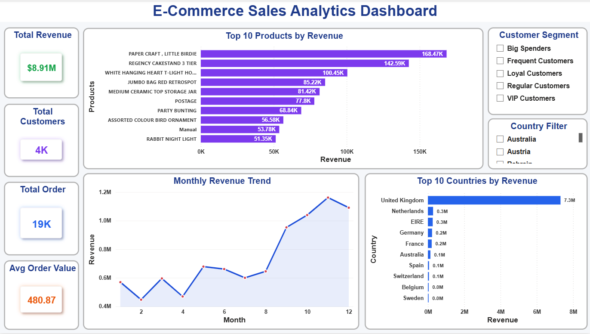
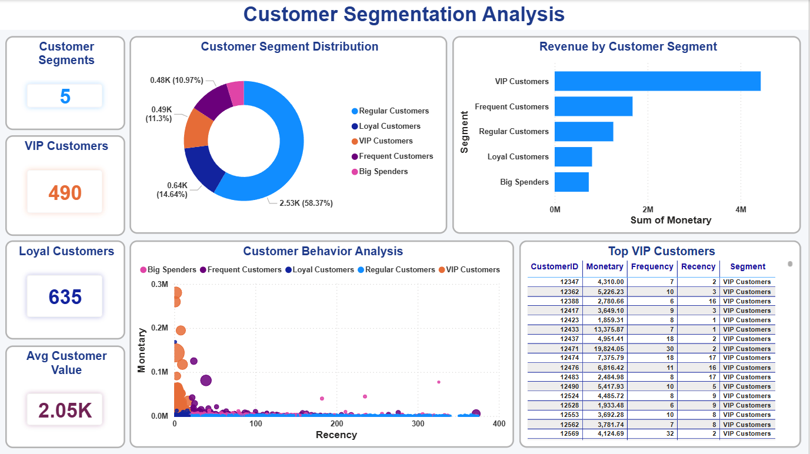
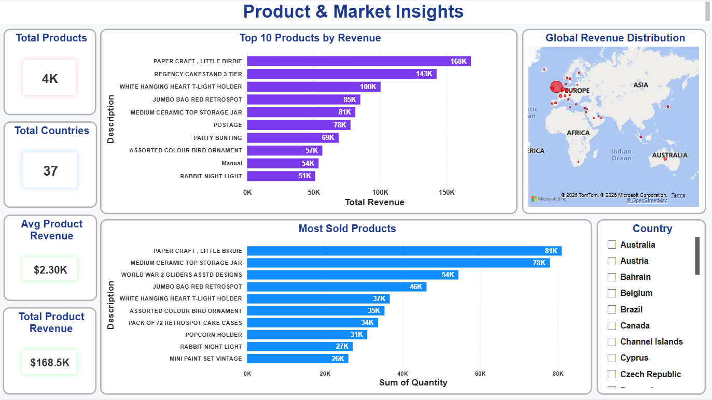
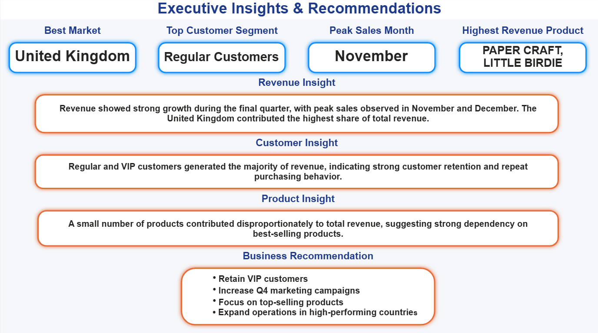
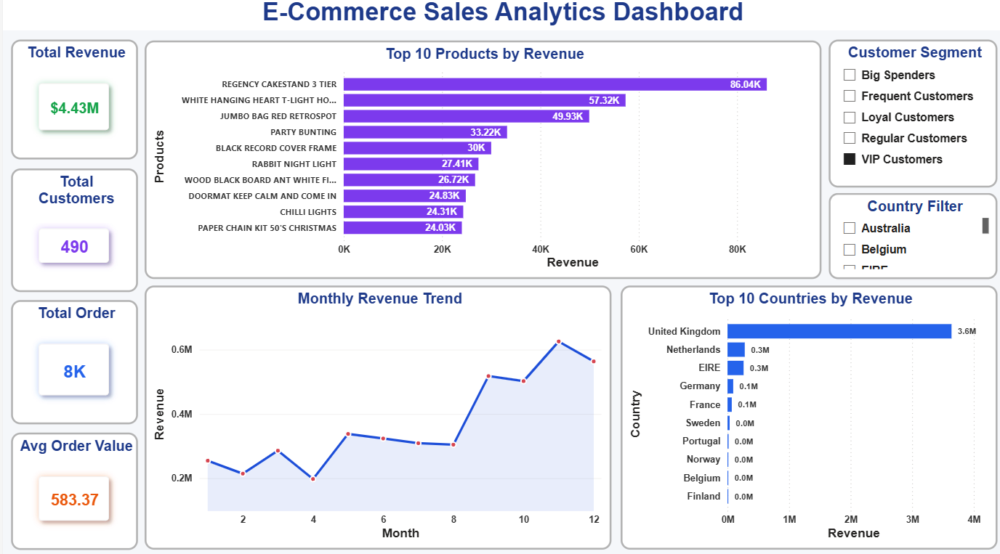
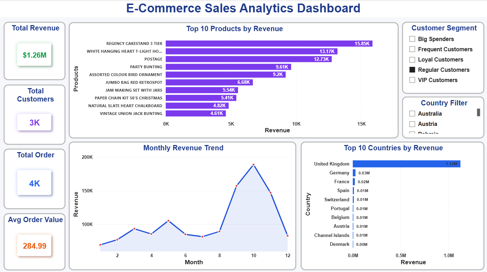
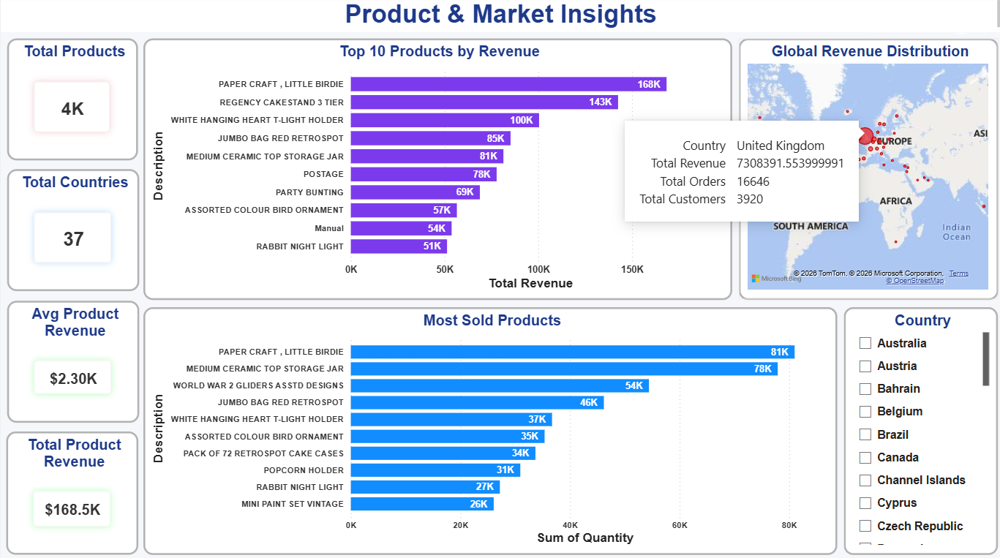

# E-Commerce Customer & Sales Insights

An end-to-end **E-Commerce Analytics** project built using **Python, SQL, and Power BI** to analyze customer behavior, sales performance, product trends, and revenue insights.

## Project Features

- Data Cleaning & Preprocessing
- Exploratory Data Analysis (EDA)
- RFM Customer Segmentation
- SQL Business Analysis
- Interactive Power BI Dashboards
- Executive Business Insights & Recommendations

---

# Tech Stack

- Python
- Pandas
- NumPy
- Matplotlib
- Seaborn
- MySQL
- Power BI

---

# Repository Structure

```text
E-Commerce-Customer-Sales-Insights/

├── Datasets/
│   ├── Raw Online Retail.zip
│   ├── cleaned ecommerce data.zip
│   └── rfm customer segments.csv
│
├── Images/
│   ├── pbi executive overview.png
│   ├── pbi customer segmentation.png
│   ├── pbi product market insights.png
│   ├── pbi executive insights.png
│   ├── pbi vip customeranalysis.png
│   ├── pbi regular customer analysis.png
│   ├── pbi country tooltip analysis.png
│   ├── python customer segmentation.png
│   ├── python monthly revenue trend.png
│   ├── python revenue by day.png
│   ├── python top customers.png
│   └── python top products revenue.png
│
├── Notebooks/
│   └── ecommerce customer sales analysis.ipynb
│
├── PowerBI/
│   └── Ecommerce Sales Dashboard.pbix
│
├── SQL/
│   └── Ecommerce Sales Analysis.sql
│
└── README.md
```

---

# Project Overview

This project analyzes an **E-Commerce transaction dataset** to uncover valuable business insights.

### Objectives

- Analyze revenue trends
- Identify seasonal sales patterns
- Discover top-performing products
- Analyze customer purchasing behavior
- Perform RFM customer segmentation
- Build executive dashboards for business decision-making

---

# Python Analysis

The Python notebook includes:

- Data Cleaning
- Missing Value Handling
- Feature Engineering
- Revenue Analysis
- Customer Segmentation (RFM)
- Product Performance Analysis
- Data Visualization

---

# SQL Business Analysis

The SQL analysis includes:

- Total Revenue Analysis
- Total Orders Analysis
- Customer Analysis
- Top Products by Revenue
- Top Countries by Revenue
- Average Order Value (AOV)
- Revenue Trend Analysis
- Customer Segmentation Queries
- Product Revenue Ranking

---

# Power BI Dashboard

The interactive dashboard provides:

- Executive Overview
- Customer Segmentation
- Product & Market Insights
- Executive Insights
- VIP Customer Analysis
- Regular Customer Analysis
- Country Tooltip Analysis

---

# Dashboard Screenshots

## Executive Overview



---

## Customer Segmentation



---

## Product & Market Insights



---

## Executive Insights



---

## VIP Customer Analysis



---

## Regular Customer Analysis



---

## Country Tooltip Analysis



---

# Python Visualizations

## Monthly Revenue Trend


---

## Revenue by Day


---

## Top Customers


---

## Top Products by Revenue


---

## Customer Segmentation


---

# Key Business Insights

- United Kingdom generated the highest revenue.
- Sales peaked during November and December.
- VIP and Loyal customers generated most of the revenue.
- Top-selling products contributed the majority of sales.
- Strong repeat purchase behavior was observed.

---

# Business Recommendations

- Strengthen VIP customer loyalty programs.
- Increase marketing campaigns during Q4.
- Focus on top-selling products.
- Expand operations in high-performing countries.

---

# How to Run the Project

## 1. Python Notebook

Open:

```text
Notebooks/ecommerce customer sales analysis.ipynb
```

Run all notebook cells.

---

## 2. SQL Analysis

Open:

```text
SQL/Ecommerce Sales Analysis.sql
```

Execute all queries using **MySQL Workbench**.

---

## 3. Power BI Dashboard

Open:

```text
PowerBI/Ecommerce Sales Dashboard.pbix
```

Refresh the dataset if required.

---

# Dataset

**Dataset:** Online Retail E-Commerce Dataset

The dataset contains:

- Transaction Details
- Product Information
- Customer Purchase History
- Country-wise Sales Data

---

# Author

**P. Uma Venkata Vinay**

**GitHub:**  
https://github.com/pasupuleti-vinay

**LinkedIn:**  
https://www.linkedin.com/in/pasupuletivinay

---

## If you found this project useful, consider giving it a Star.
